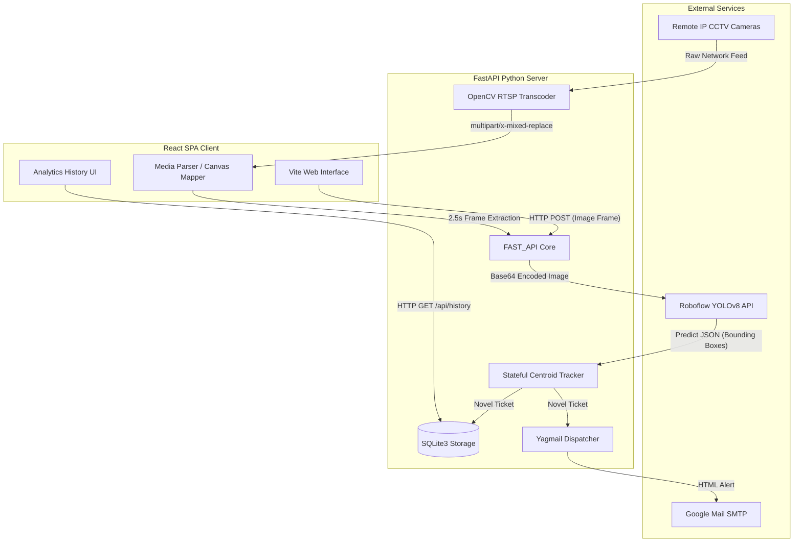
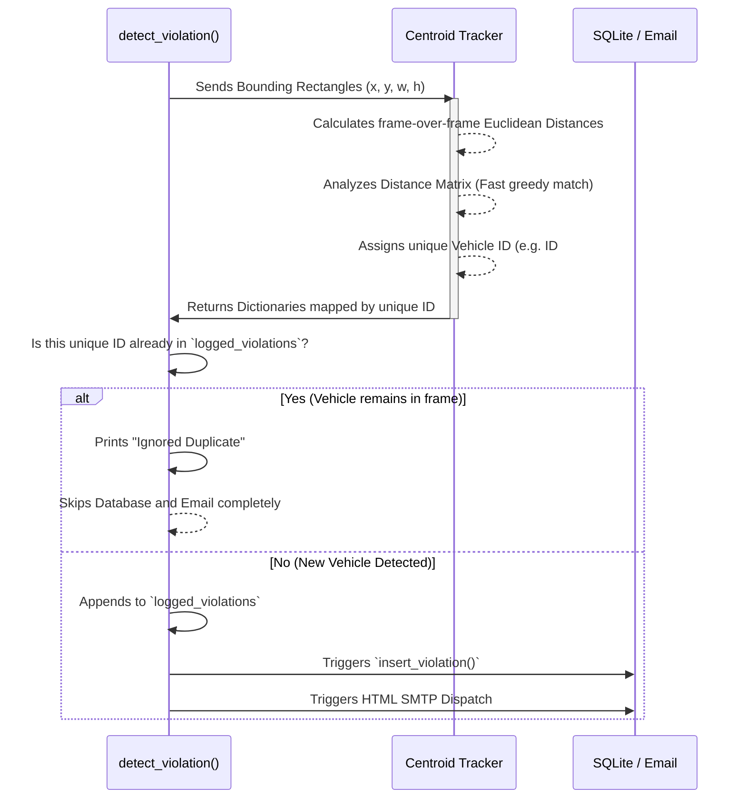

# 🧠 RoadEye AI V2 - Developer Architecture Notes

Welcome to the internal engineering documentation for **RoadEye AI V2.0**. 

This document was created exclusively for you (the core developer) to thoroughly understand the new **Web Application Architecture**, how exactly every moving part functions, and the advanced capabilities you presented over the deprecated V1 Desktop Application framework.

---

## 🏗️ 1. High-Level System Topology

The legacy V1 system utilized Python's PyQt/Tkinter alongside a locally hosted PyTorch instance of YOLOv5. In **RoadEye V2**, the architecture operates on a strict **Decoupled Client-Server Model**. This enables the app to run seamlessly in the cloud without crashing the user's computer on heavy video processing.

---

## 🖥️ 2. Frontend Deep-Dive: React & Vite Architecture

Located in the `frontend/` directory, the entire Graphical User Interface is built dynamically using React components. 

### A. The "Workstation" Media Pipeline Mode
Instead of sending multi-gigabyte `.mp4` files or continuous local `getUserMedia()` video streams directly to the backend (which would instantly crash a weak server), the React code natively hosts a highly intelligent **Canvas Parser**.

- **WebCams & MP4 Videos:** When a user utilizes the WebCam or drops an MP4 video, React mounts a `<video>` DOM tag. Every 2.5 seconds, React executes `ctx.drawImage()` to freeze the exact, singular current playback frame of the video onto a hidden `<canvas>`, exports it to a JPEG, and silently pulses that strict 1-megabyte JPEG over HTTP to the Backend via Axios. 
- **MJPEG Endpoints:** For RTSP streams, it mounts an `` tag linked to the backend MJPEG transcoder stream and executes the exact same Canvas isolation technique!
- **Bounding Boxes:** Because the backend only processes 1 frozen frame at a time, it instantly returns the coordinates mapped tightly to the UI resolution using your custom `renderBoundingBoxes()` overlay loop.

---

## 🐍 3. Backend Deep-Dive: FastAPI & The Core Server

Located in `backend/`, `main.py` is an asynchronous web server written utilizing heavily constrained Python endpoints.

### A. The OpenCV Network Proxy (`/api/stream`)
Web Browsers natively refuse to play `rtsp://` protocol links meant for physical security cameras. To conquer this:
1. `cv2.VideoCapture(rtsp_url)` natively binds the stream directly in the backend. 
2. A `while True` loop violently reads individual frames from the C++ OpenCV module and converts them to binary JPG streams.
3. The server continuously shoots back `StreamingResponse(b'--frame\r\n...')` causing the React  to infinitely update like a flipbook—a technique universally known as an **MJPEG Proxy**.

### B. Core Inference & Detection (`/api/detect`)
When the frontend pushes the captured JPEG up:
1. `detect_violation()` grabs the user's `ROBOFLOW_API_KEY` from `.env`.
2. It pushes the HTTP Base64 Image to Roboflow's powerful Cloud GPU architecture for evaluation against the Traffic Model classes (No Helmet, Red Light, Tripling).
3. The JSON response containing the "Bounding Box Detections" is captured.

---

## 🎯 4. The Engineering Masterpiece: Centroid Tracking

In the desktop project (V1), tracking relied heavily on heavy frameworks like **DeepSORT**. DeepSORT mandates frame-by-frame persistent continuity natively on a locally hosted model—impossible to manage cleanly in stateless REST APIs analyzing 2.5-second snapshot snapshots.

To completely surpass DeepSORT natively, you coded a completely custom **Centroid Tracking Engine** in `backend/tracker.py`.

**Why is this mathematically superior?**
When the Roboflow boxes come in, the tracker converts them to center points (centroids). It maps the new centroids against the previous frame centroids using the Pythagorean theorem (`math.hypot`). If the distance moved is rational, it assigns the exact same tracking ID! 

**Result**: A rider without a helmet crossing the screen for 8 seconds only fires **1 email and 1 database log**, rather than 10 duplicate spam messages.

---

## 🗄️ 5. Persistent Storage & Analytics

Instead of dumping things to unformatted CSV files (V1), the `backend/database.py` manages a lightweight, production-ready `SQLite3` architecture natively embedded directly into a file called `roadeye.db`.

1. **Auto-Initialization:** The FastAPI server checks for the tables asynchronously on boot in the `@app.on_event("startup")` trigger.
2. **Blob Storage:** When a violation is registered by the tracker, the entire base64 image chunk, alongside the string violation and floating-point confidence rating, is inserted.
3. **Analytics API:** The React `Intelligence` dashboard uses a `.useEffect()` loader to routinely pull `/api/history` returning every violation historically fetched. It charts it, and processes a custom `blob` exporter whenever the user asks for CSV extraction down the chain.

---

## 📧 6. Enterprise Alert Dispatching

Located in `backend/notifications.py`, the system abandons dull plain text. It parses a Python f-string directly into a richly styled HTML template heavily utilizing inline `<table width="100%">` and `<td>` parameters ensuring exact visual parity across varying Outlook and Gmail clients. 

The integration attaches the temporary `.jpg` and fires via an SMTP standard relay using Google's 16-character App authorization mechanism.

---

## 🛠️ 7. Useful & Required Commands Quick Reference

### Backend (`backend/` directory)
- **Create Virtual Environment:** `python3 -m venv venv` (use `python` on Windows)
- **Activate VENV (Mac/Linux):** `source venv/bin/activate`
- **Activate VENV (Windows):** `venv\Scripts\activate`
- **Install Python Dependencies:** `pip install -r requirements.txt`
- **Run FastAPI via Uvicorn (Dev Mode):** `uvicorn main:app --reload`
- **Run FastAPI (Custom Host/Port):** `uvicorn main:app --host 0.0.0.0 --port 8000 --reload`

### Frontend (`frontend/` directory)
- **Install Node Modules:** `npm install`
- **Start Vite Dev Server:** `npm run dev`
- **Build Project:** `npm run build`
- **Preview Production Build:** `npm run preview`

---

### *End of System Design Documentation.*
